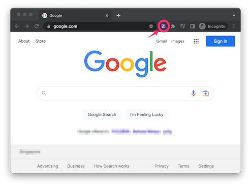
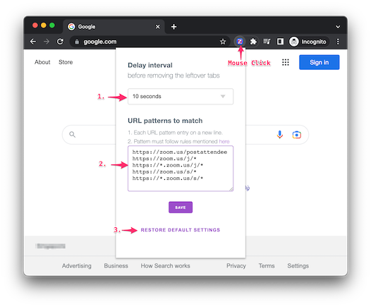
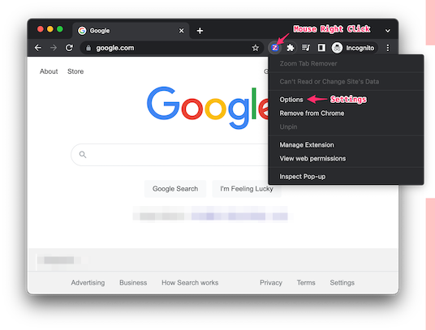
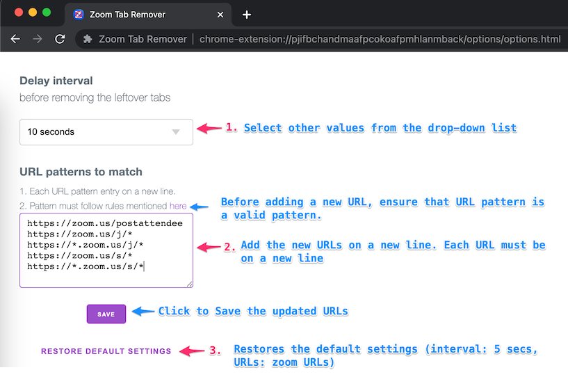
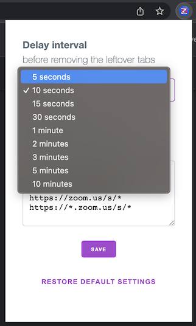

# Zoom Tab Remover


An extension for Google Chrome that closes any lingering Zoom tabs that are left open after the Zoom meetings are opened. After 5 seconds, these Zoom tabs will shut by themselves thanks to this add-on. (configurable to 10, 15, 30,  seconds and more).

Bluejeans, Microsoft Team, Amazon Chime, and any other launcher application's URLs can be added here as well.

It is safe and secure. No analytics. No ads. Completely free. No data leaves your computer via this extension. This extension doesn't send any info away from your computer. It doesn't send any information to other servers.

## Version 1.0.0

# Install Extension
[https://chrome.google.com/webstore/detail/zoom-tab-remover/aipgpbkgomhfcdkibhkooenbgimpiigf](https://chrome.google.com/webstore/detail/zoom-tab-remover/aipgpbkgomhfcdkibhkooenbgimpiigf)

# Settings

The default options should be adequate for most users. You might want to keep the current values.

You can, however, adjust these parameters as you see fit.

When you click on the extension, a window will appear where you can make adjustments:





Or, you can click on the options in extension menu (right click on the extension)






## 1. Delay Interval

**Default value** *5 seconds.*

### Delay Description

The extension wait for the Zoom tabs (or, others tab) to complete the loading of the link before it triggers the timer to close the tab. However in certain situations, if you prefer to increase or decrease the interval, you can update the `Delay interval` to 5, 10, 15, 30 seconds or 1, 2, 3, 5, 10 minutes.



## 2. URL Patterns to match

**Default values**

```
https://zoom.us/postattendee
https://zoom.us/j/*
https://*.zoom.us/j/*
https://zoom.us/s/*
https://*.zoom.us/s/*
```

### URL Description

Often you feel a need to use this extension for closing other tabs which are launched by application such as Bluejeans, Microsoft Team, Amazon Chime, and others. You can add there URLs in this field. Once saved, it will close such URLs.

Don't forget to test the behavior after updating this field. Open a tab with the new URL, it should be closed after specified delay interval. If it doesn't work as expected, you can always go back to default settings by clicking on `Restore Default Settings` link.

## 3. Restore Default Settings

As the title suggests, you can always reset the settings back to default settings by clicking on the `Restore Default Settings`

# FAQs

### Is it safe?

Absolutely.

This extension keeps all the information locally in your browser. There is no communication (upload/download) related to your browsing history to (or from) any server. No data leaves your computer from this extension. No analytics. No ads. Completely free.

### The tabs are closed too early. What should I do?

You can increase the interval in the `Delay Interval` field.

### Can I add more URLs?

Yes, you can. URLs must follow the pattern mentioned at https://developer.chrome.com/docs/extensions/mv3/match_patterns/

```
<url-pattern> := <scheme>://<host><path>
<scheme> := '*' | 'http' | 'https' | 'file' | 'ftp' | 'urn'
<host> := '*' | '*.' <any char except '/' and '*'>+
<path> := '/' <any chars>
```

<table class="fixed-table width-full"><tbody><tr><th style="margin-left:0; padding-left:0">Pattern</th><th style="margin-left:0; padding-left:0">What it does</th><th style="margin-left:0; padding-left:0">Examples of matching URLs</th></tr><tr><td><code>https://*/*</code></td><td>Matches any URL that uses the <code>https</code> scheme</td><td>https://www.google.com/<br>https://example.org/foo/bar.html</td></tr><tr><td><code>https://*/foo*</code></td><td>Matches any URL that uses the <code>https</code> scheme, on any host, as long as the path starts with <code>/foo</code></td><td>https://example.com/foo/bar.html<br>https://www.google.com/foo<b></b></td></tr><tr><td><code>https://*.google.com/foo*bar</code></td><td>Matches any URL that uses the <code>https</code> scheme, is on a google.com host (such as www.google.com, docs.google.com, or google.com), as long as the path starts with <code>/foo</code> and ends with <code>bar</code></td><td>https://www.google.com/foo/baz/bar<br>https://docs.google.com/foobar</td></tr><tr><td><code>https://example.org/foo/bar.html</code></td><td>Matches the specified URL</td><td>https://example.org/foo/bar.html</td></tr><tr><td><code>file:///foo*</code></td><td>Matches any local file whose path starts with <code>/foo</code></td><td>file:///foo/bar.html<br>file:///foo</td></tr><tr><td><code>http://127.0.0.1/*</code></td><td>Matches any URL that uses the <code>http</code> scheme and is on the host 127.0.0.1</td><td>http://127.0.0.1/<br>http://127.0.0.1/foo/bar.html</td></tr><tr><td><code>*://mail.google.com/*</code></td><td>Matches any URL that starts with <code>http://mail.google.com</code> or <code>https://mail.google.com</code>.</td><td>http://mail.google.com/foo/baz/bar<br>https://mail.google.com/foobar</td></tr><tr><td><code>urn:*</code></td><td>Matches any URL that starts with <code>urn:</code>.</td><td>urn:uuid:54723bea-c94e-480e-80c8-a69846c3f582<br>urn:uuid:cfa40aff-07df-45b2-9f95-e023bcf4a6da</td></tr><tr><td><code>&lt;all_urls&gt;</code></td><td>Matches any URL that uses a permitted scheme. (See the beginning of this section for the list of permitted schemes.)</td><td>http://example.org/foo/bar.html<br>file:///bar/baz.html</td></tr></tbody></table>

Here are some examples of *invalid* pattern matches:

<table class="fixed-table width-full"><tbody><tr><th style="margin-left:0; padding-left:0">Bad pattern</th><th style="margin-left:0; padding-left:0">Why it's bad</th></tr><tr><td><code>https://www.google.com</code></td><td>No <em>path</em></td></tr><tr><td><code>https://*foo/bar</code></td><td>'*' in the <em>host</em> can be followed only by a '.' or '/'</td></tr><tr><td><code>https://foo.*.bar/baz&nbsp;</code></td><td>If '*' is in the <em>host</em>, it must be the first character</td></tr><tr><td><code>http:/bar</code></td><td>Missing <em>scheme</em> separator ("/" should be "//")</td></tr><tr><td><code>foo://*</code></td><td>Invalid <em>scheme</em></td></tr></tbody></table>


## What should be the URL for closing Microsoft Teams launcher tabs?

``` 
https://teams.microsoft.com/dl/launcher/*
```

## Any test URLs for testing?

```
https://zoom.us/postattendee
https://zoom.us/wc/leave
https://zoom.us/test
```

## Issues/ Bugs

Report [Here](https://github.com/chandan-singh/zoom-tab-remover/issues)

## Contributions

Welcome contributors! Thanks in advance.

## Privacy Policy

[Link](/privacy.md)

## Disclaimer and Notices

Zoom Video Communications, Inc. owns the copyright for "Zoom." This extension is not made or supported by Zoom Video Communications in any way.

All trademarks, logos and brand names are the property of their respective owners. All company, product and service names used in this website are for identification purposes only. Use of these names, trademarks and brands does not imply endorsement.

We assume no responsibility or liability for any errors or omissions or loss due to the use of this extension.
